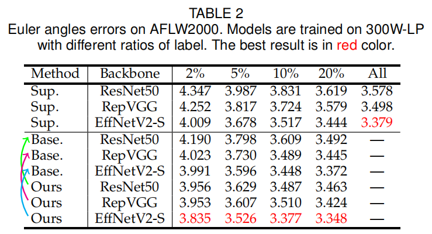
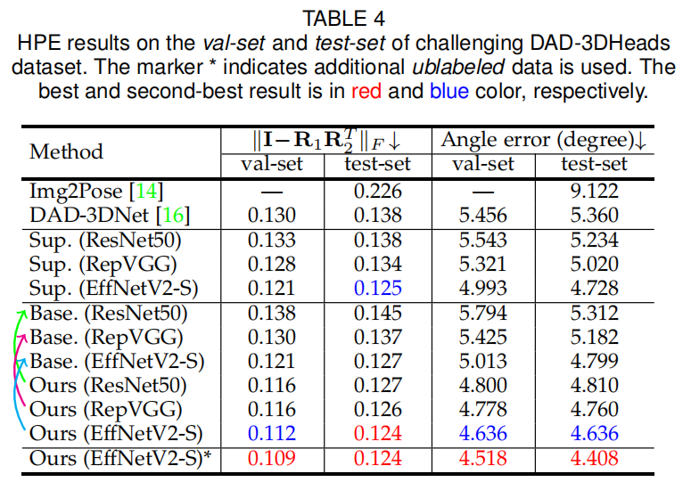

# SemiUHPE
Code for my paper `"Semi-Supervised Unconstrained Head Pose Estimation in the Wild"`. The paper is under review. Please see demos / manuscript / models in the [`Project`](https://hnuzhy.github.io/projects/SemiUHPE/) / [`arXiv`](https://arxiv.org/abs/2404.02544) / [`HuggingFace`](https://huggingface.co/HoyerChou/SemiUHPE), correspondingly.

<p align="center"></p>
The unconstrained head pose estimation results of our SemiUHPE on wild challenging heads (e.g., heavy blur, extreme illumination, severe occlusion, atypical pose, and invisible face).

<p align="center"></p>
Qualitative results of our method (3rd line) and DAD-3DNet (2nd line) on heads from DAD-3DHeads test-set (1st line), which never appeared during SSL training.

***

## ● Abstract 
<p align="center"></p>

> Existing research on **unconstrained in-the-wild** head pose estimation suffers from the flaws of its datasets, which consist of either numerous samples by non-realistic synthesis or constrained collection, or small-scale natural images yet with plausible manual annotations. To alleviate it, we propose the first **semi-supervised unconstrained head pose estimation** method SemiUHPE, which can leverage abundant easily available unlabeled head images. Technically, we choose semi-supervised rotation regression and adapt it to the error-sensitive and label-scarce problem of unconstrained head pose. Our method is based on the observation that the aspect-ratio invariant cropping of wild heads is superior to the previous landmark-based affine alignment given that landmarks of unconstrained human heads are usually unavailable, especially for less-explored non-frontal heads. Instead of using an empirically fixed threshold to filter out pseudo labeled heads, we propose dynamic entropy based filtering to adaptively remove unlabeled outliers as training progresses by updating the threshold in multiple stages. We then revisit the design of weak-strong augmentations and improve it by devising two novel head-oriented strong augmentations, termed pose-irrelevant cut-occlusion and pose-altering rotation consistency respectively. Extensive experiments and ablation studies show that SemiUHPE outperforms existing methods greatly on public benchmarks under both the **front-range** and **full-range** settings.

## ● Main Results

<table>
  <tr>
    <th>Results of Euler angles errors on AFLW2000</th>
    <th>Results of HPE on the challenging DAD-3DHeads</th>
  </tr>
  <tr>
    <td></td>
    <td></td> 
  </tr>
</table>

## ● Environment
- PyTorch=1.13.1 + torchvision=0.14.1 + cudatoolkit=11.8
- PyTorch3D==0.7.2 (Installation via `conda` or `pypi` may be problematic. Build from source if necessary.)
- Remember `cd Sim3DR` and install the 3d face mesh render for head pose visualization.
- Other dependencies
    ```bash
    pip install opencv-python tqdm matplotlib scipy tensorboard configargparse lmdb pyyaml
    ```

## ● Dataset Preparing
- For training datasets, please follow our [huggingface](https://huggingface.co/HoyerChou/SemiUHPE) or [hf-mirror.com](https://hf-mirror.com/HoyerChou/SemiUHPE) link to download labeled data (e.g., `300W-LP & AFLW2000` and `DAD-3DHeads`) and unlabeled data (e.g., `WildHead `, `COCOHead`, `CrowdHuman` and `OpenImageV6`).
- For pretrained backbones, please download the `RepVGG` wight from [links.txt](./weights/links.txt). Other used backbones including `ResNet50`, `EfficientNetV2-S`, `EfficientNet-B4` and `TinyViT-21M` can be downloaded automaticly.

## ● Training and Evaluation

### For training and testing offline 
- Training Example 1 - Fully Supervised Training (Supervised): 20% labeled 300WLP + unlabeled left 300WLP (not used) + testing on AFLW2000
  ```bash
  $ python train.py --config settings/300WLP_AFLW2000.yml --test_set AFLW2000 --network effinetv2 --num_workers 4
    --stage1_iteration 60000 --max_iteration 60000 --ss_ratio 0.2 --gpu_ids 0 --batch_size 32 --val_frequency 500
  $ python eval.py SSL1.0_r0.2_ce_effinetv2_t-5.3_b32_ema/Julxx_xxxxxx/best \
    --config settings/300WLP_AFLW2000.yml --network effinetv2 --batch_size 32 --gpu_ids 0
  ```
- Training Example 2 - Semi-Supervised Training (SemiUHPE): 20% labeled 300WLP + unlabeled left 300WLP (used) + testing on AFLW2000
  ```bash
  $ python train.py --config settings/300WLP_AFLW2000.yml --network effinetv2 --num_workers 4 --stage1_iteration 60000 \
    --max_iteration 100000 --ss_ratio 0.20 --gpu_ids 0 --batch_size 32 --val_frequency 500 --ulb_batch_ratio 4 \
    --dynamic_thres --cutout_aug --cutmix_aug --SSL_lambda 1.0 --left_ratio 0.95
  $ python eval.py SSL1.0_r0.2_ce_effinetv2_tDyna0.95_b32_ema_CO_CM/Julxx_xxxxxx/best \
    --config settings/300WLP_AFLW2000.yml --network effinetv2 --batch_size 32 --gpu_ids 0
  ```
- Training Example 3 - Semi-Supervised Training (Baseline): 10% labeled 300WLP + unlabeled left 300WLP (used) + testing on AFLW2000
  ```bash
  $ python train.py --config settings/300WLP_AFLW2000.yml --network effinetv2 --num_workers 4 --stage1_iteration 40000 \
    --max_iteration 80000 --ss_ratio 0.10 --gpu_ids 1 --batch_size 32 --val_frequency 500 --ulb_batch_ratio 4 --conf_thres -5.4
  $ python eval.py SSL1.0_r0.1_ce_effinetv2_t-5.4_b32_ema/Julxx_xxxxxx/best \
    --config settings/300WLP_AFLW2000.yml --network effinetv2 --batch_size 32 --gpu_ids 0
  ```
- Training Example 4 - Semi-Supervised Training (SemiUHPE): all labeled 300WLP + unlabeled COCOHead + testing on AFLW2000
  ```bash
  $ python train.py --config settings/300WLP_COCOHead.yml --network effinetv2 --num_workers 8 --stage1_iteration 90000 \
    --max_iteration 120000 --gpu_ids 1 --batch_size 32 --val_frequency 500 --ulb_batch_ratio 8 --dynamic_thres \
    --cutout_aug --cutmix_aug --SSL_lambda 1.0 --left_ratio 0.75
  $ python eval.py SSL1.0_r0.05_ce_effinetv2_tDyna0.75_b32_ema_CO_CM/Julxx_xxxxxx/best \
    --config settings/300WLP_COCOHead.yml --network effinetv2 --batch_size 32 --gpu_ids 0
  ```
- Training Example 5 - Semi-Supervised Training (SemiUHPE): labeled DAD3DHeads train-set + unlabeled COCOHead + testing on DAD3DHeads val-set
  ```bash
  $ python train.py --config settings/DAD3DHeads_COCOHead.yml --network effinetv2 --num_workers 4 --stage1_iteration 100000 \
    --max_iteration 200000 --gpu_ids 1 --batch_size 32 --val_frequency 500 --ulb_batch_ratio 4 --is_full_range \
    --dynamic_thres --cutout_aug --cutmix_aug --rotate_aug --SSL_lambda 1.0  --left_ratio 0.75
  $ python eval.py SSL1.0_r0.05_ce_effinetv2_tDyna0.75_b32_ema_RO_CO_CM_full/Julxx_xxxxxx/best --is_full_range \
    --config settings/DAD3DHeads_COCOHead.yml --network effinetv2 --batch_size 32 --gpu_ids 0
  ```
### For online evaluation
- Evaluation Example 1 (on DAD3DHeads test-set): SemiUHPE + effinetv2-s (WildHead)
  ```bash
  $ python eval_DAD3DHeads.py SSL1.0_r0.05_ce_effinetv2_tDyna0.75_b64_ema_RO_CO_CM_full/Julxx_xxxxxx/best \
    --is_full_range --config settings/DAD3DHeads_WildHead.yml --network effinetv2 --gpu_ids 1
  ```
- Evaluation Example 2 (on DAD3DHeads test-set): SemiUHPE + resnet50 (COCOHead)
  ```bash
  $ python eval_DAD3DHeads.py SSL1.0_r0.05_ce_tDyna0.75_b16_ema_RO_CO_CM_full/Sep20_195132/best \
    --is_full_range --config settings/DAD3DHeads_COCOHead.yml --network resnet50 --gpu_ids 1
  ```
  Then, the obtained json files should be emailed to dad3dheads@gmail.com as in [dad_3dheads_benchmark](https://github.com/PinataFarms/DAD-3DHeads/tree/main/dad_3dheads_benchmark).
### For inference on images/videos
- Inference Example 1 (on images): SemiUHPE + resnet50 (COCOHead)
  ```bash
  $ python image.py DAD-COCOHead-ResNet50-best --is_full_range --config settings/DAD3DHeads_COCOHead.yml \
    --network resnet50 --gpu_ids 1
  ```
- Inference Example 2 (on videos): SemiUHPE + effinetv2-s (WildHead)
  ```bash
  $ python video.py DAD-WildHead-EffNetV2-S-best --is_full_range --config settings/DAD3DHeads_WildHead.yml \
    --network effinetv2 --gpu_ids 1
  ```
  Note, the corresponding pretrained model weights `DAD-COCOHead-ResNet50-best.pth` and `DAD-WildHead-EffNetV2-S-best.pth` for unconstrained head pose estimation are released in [huggingface](https://huggingface.co/HoyerChou/SemiUHPE) or [hf-mirror.com](https://hf-mirror.com/HoyerChou/SemiUHPE).

  For the used `head detection` model weight **ch_head_l_1536_e150_best_mMR.pt** in [image.py](https://github.com/hnuzhy/SemiUHPE/blob/main/image.py#L136) and [video.py](https://github.com/hnuzhy/SemiUHPE/blob/main/video.py#L131) scripts, you can download it from our previous work [BPJDetPlus](https://huggingface.co/HoyerChou/BPJDet/blob/main/ch_head_l_1536_e150_best_mMR.pt) for `body-head joint detection` of multiple persons.

  Many more impressive demos of images and videos can be found in our [project homepage](https://hnuzhy.github.io/projects/SemiUHPE/).


## ● Acknowledgement
Our codebase is partly based on [Probabilistic matrix-Fisher](https://github.com/Davmo049/Public_prob_orientation_estimation_with_matrix_fisher_distributions), [FisherMatch](https://github.com/yd-yin/FisherMatch/) and [DAD-3DHeads](https://github.com/PinataFarms/DAD-3DHeads). The head detection model is based on our previous work [BPJDet](https://hnuzhy.github.io/projects/BPJDet/) for `multi-person body-head joint detection`. The 3d face mesh render is based on [3DDFA_V2 - Sim3DR](https://github.com/cleardusk/3DDFA_V2/tree/master/Sim3DR). We also thank public wild head-related datasets [COCOHead](https://cocodataset.org/), [HumanParts](https://github.com/soeaver/Hier-R-CNN#dataset), [CrowdHuman](https://www.crowdhuman.org/), [BFJDet](https://github.com/AibeeDetect/BFJDet#1-crowdhuman) and [OpenImageV6](https://storage.googleapis.com/openimages/web/index.html) for their excellent dataset construction and laborious labels annotation.


## ● Citation
If you use our code or models in your research, please cite with:
```bash
@article{zhou2024semi,
  title={Semi-Supervised Unconstrained Head Pose Estimation in the Wild},
  author={Zhou, Huayi and Jiang, Fei and Jin, Yuan and Yong, Rui and Lu, Hongtao and Kui, Jia},
  journal={arXiv preprint arXiv:2404.02544},
  year={2024}
}
```

  
